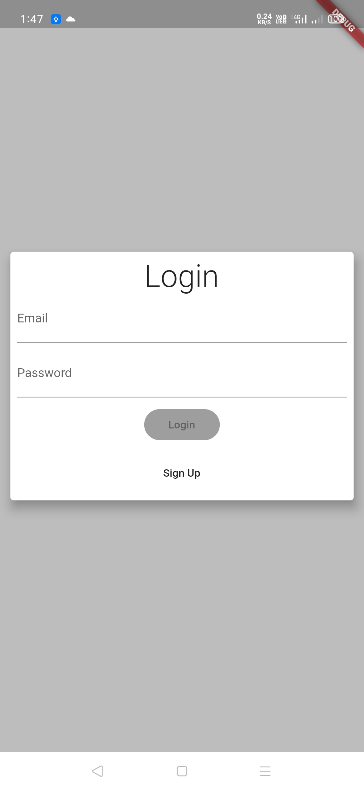
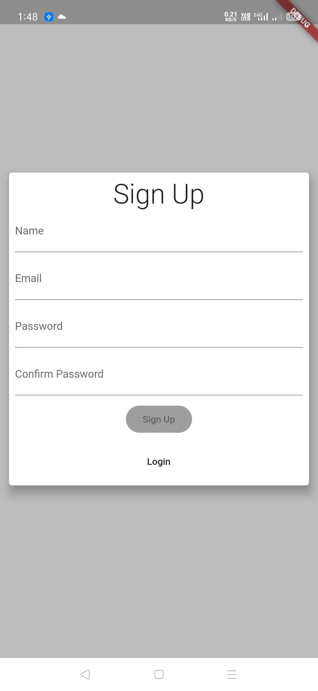
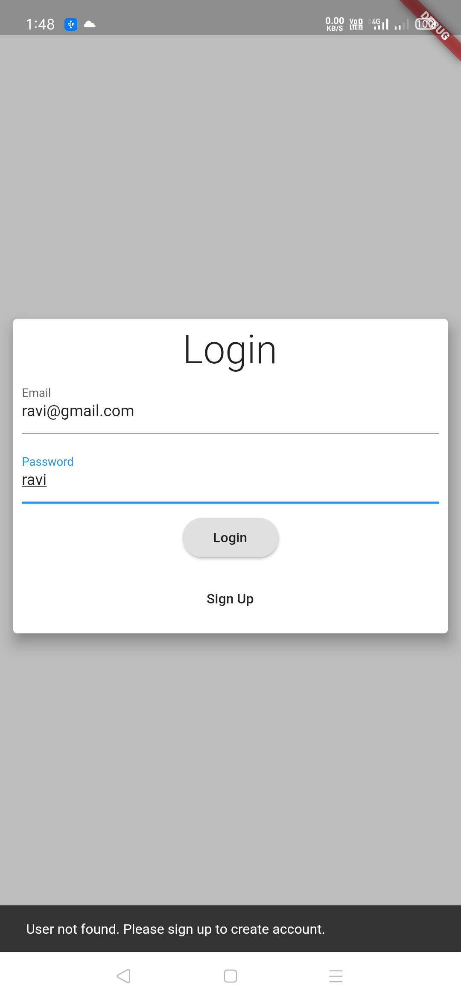
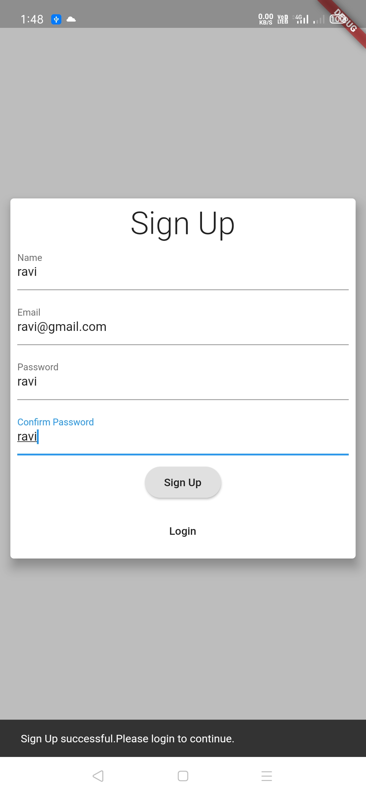
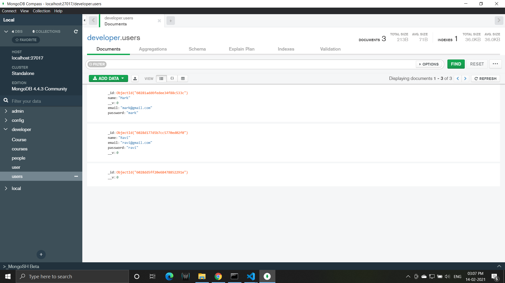
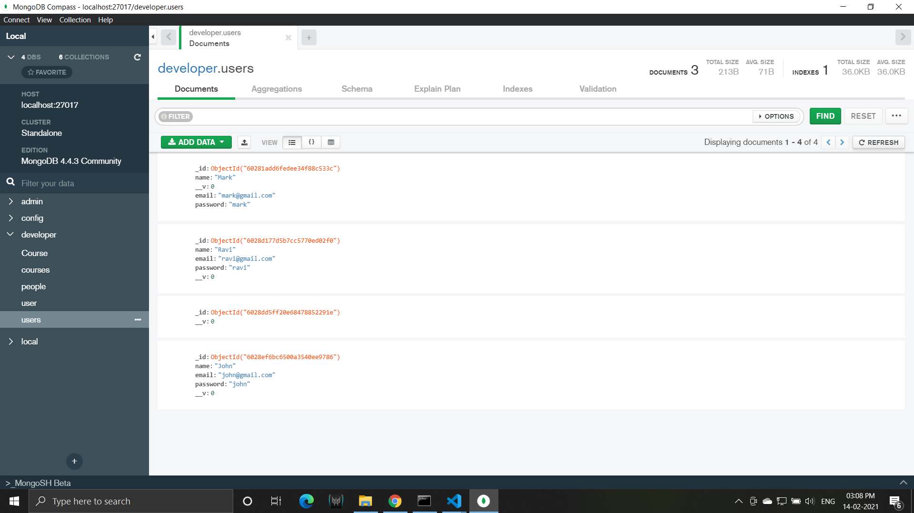

# Bloc Login

User login built using bloc and MongoDB as database.

Link to apk: https://drive.google.com/file/d/1L73FTi0ZtY2o23g9nzQyQPz4FWVkic8H/view

Note: This apk does not utilise MongoDB for database. The code has been changed to integrate call to MongoDB for login and sign up.

Please refer to this link for code to the api for login and sign up: https://github.com/ravihoro/mongodb-login . 

## Features
- Login and sign up using bloc and flutter_bloc package
- MongoDB database for storing users.

## Technologies Used
- Flutter

## Screenshots
       
